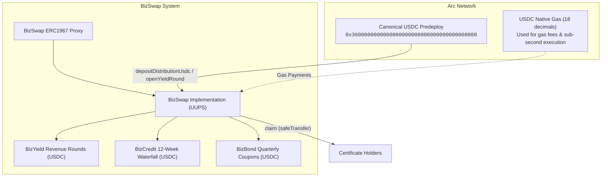

# BizSwap — Arc Network Technical Specification & Documentation

Upgradeable Solidity implementation of **BizSwap** Real World Asset (RWA) instruments on **Arc Network**.

| Item                 | Value                                                                                          |
| -------------------- | ---------------------------------------------------------------------------------------------- |
| **Network**          | Arc Testnet (5042002) → Arc Mainnet (5042)                                                     |
| **Contract**         | `BizSwap` (UUPS upgradeable ERC-721 orchestrator)                                              |
| **Gas Token**        | **USDC** (Native 18 decimals, deterministic sub-second finality)                               |
| **Stablecoin Asset** | **USDC** (Canonical ERC-20 predeploy `0x3600000000000000000000000000000000000000`, 6 decimals) |
| **Collection**       | ERC-721 name `BizSwap`, symbol `BIZ`                                                           |
| **Phases**           | Phase 1 (registry & vesting) + Phase 2 (USDC distributions)                                    |
| **Tooling**          | Arc Foundry (`arc-forge`, `arc-cast`, `arc-anvil`) / Standard Foundry                          |

---

## 1. System Architecture

The project adopts a **Central Orchestrator Pattern**. A single upgradeable contract, **`BizSwap`**, manages the full lifecycle of three instrument types: **BizYield**, **BizCredit**, and **BizBond**.

Users and backend systems always interact with the **ERC1967 proxy** address. The implementation can be upgraded via UUPS without altering the canonical proxy address.



### Data Modeling & Storage

| Concept            | Arc / Solidity Implementation                                      |
| ------------------ | ------------------------------------------------------------------ |
| Program            | `BizSwap` implementation + ERC1967 proxy                           |
| Global Config      | Contract fields: roles, `revenueWallet`, `usdc`, `usdcDecimals`    |
| Instrument Config  | `mapping(uint8 => Instrument) instruments`                         |
| Certificate Record | `mapping(uint256 => Certificate) certificates` + ERC-721 ownership |
| NFT Token          | ERC-721 `tokenId` + `tokenURI`                                     |
| Transfer Lock      | Vesting status + `_update` transfer lock / `unlock()`              |

#### Global Config (Roles & Pointers)

Access control is governed by OpenZeppelin's `AccessControlUpgradeable` via 32-byte role identifiers (`bytes32`):

| Role Constant | `bytes32` Hex Identifier | Underlying Value / Calculation | Description & Permissions |
| :--- | :--- | :--- | :--- |
| `DEFAULT_ADMIN_ROLE` | `0x0000000000000000000000000000000000000000000000000000000000000000` | `bytes32(0)` | Setup instruments & schedules, pauses, UUPS upgrades, revenue wallet updates |
| `UPGRADER_ROLE` | `0x189ab7a9244df0848122154315af71fe140f3db0fe014031783b0946b8c9d2e3` | `keccak256("UPGRADER_ROLE")` | Dedicated authority for `upgradeToAndCall` (held by deployer and admin) |
| `MINTER_ROLE` | `0x9f2df0fed2c77648de5860a4cc508cd0818c85b8b8a1ab4ceeef8d981c8956a6` | `keccak256("MINTER_ROLE")` | Backend authority for `mintCertificate` only |
| `DISTRIBUTOR_ROLE` | `0xfbd454f36a7e1a388bd6fc3ab10d434aa4578f811acbbcf33afb1c697486313c` | `keccak256("DISTRIBUTOR_ROLE")` | Funds pool (`depositDistributionUsdc`), opens yield rounds (`openYieldRound`) |

- **`revenueWallet`**: Treasury pointer (`address`) where off-chain purchase funds settle in Phase 1.
- **`usdc`**: Canonical Arc USDC ERC-20 predeploy (`0x3600000000000000000000000000000000000000`).

#### Arc Stablecoin-Native Model

On Arc, the native gas token is USDC, and the native balance and the ERC-20 USDC interface are the **same pool of funds**:

- **Native view (18 decimals)**: Used for gas fees and `msg.value`.
- **ERC-20 view (6 decimals)**: At `0x3600000000000000000000000000000000000000`. Used for all BizSwap distribution deposits, pool tracking, and holder claims.
- **Dual-Interface Guard**: BizSwap enforces non-payable execution and rejects raw native transfers to prevent accidental native balance locking.

#### Instrument Config (`instruments[id]`)

- `id`: `0` BizYield, `1` BizCredit, `2` BizBond
- `supplyCap` / `currentSupply` (default cap **1,000** per instrument)
- `minBuyInCents` (USDC cents, 2 decimals)
- `totalInvestedCents` / `totalFeesCents`

Default minimum buy-ins:

| ID  | Instrument | Min Buy-In               |
| --- | ---------- | ------------------------ |
| 0   | BizYield   | $10 → `1_000` cents      |
| 1   | BizCredit  | $100 → `10_000` cents    |
| 2   | BizBond    | $1,000 → `100_000` cents |

#### Certificate Record (`certificates[tokenId]`)

Per-purchase terms stored on-chain:

- `instrumentId`, `amountCents` (net principal), `feeCents`
- `entitlementBps` (BizYield share of each revenue round; 10,000 = 100%)
- `purchaseTime`, `vestEnd`, `yieldStart`
- `status`: `Vesting` | `Active` | `Redeemed`
- `serial`, `cycle`

Source of truth for ownership: **`ownerOf(tokenId)`** (ERC-721 standard).

---

## 2. Technical Workflow

### Phase 1 — Minting Pipeline

`mintCertificate` is invoked by **`MINTER_ROLE` only** (backend after payment confirmation):

1. **Validation**: Minter role, instrument configured, supply < cap, amount ≥ min buy-in, non-empty URI, recipient != `address(0)`.
2. **Fee Accounting**:
   - **BizYield & BizBond**: `feeCents = net * 50 / 10_000` (0.5% **on top** of net).
   - **BizCredit**: `feeCents = 0`.
   - Certificate principal and entitlement calculations strictly use **net cents**.
3. **State Mutation**: Increments current supply and totals; allocates sequential `tokenId` and per-instrument `serial`.
4. **Status**: BizCredit → `Active`; BizYield / BizBond → `Vesting`.
5. **ERC-721**: `_safeMint` + `_setTokenURI`.
6. **Event**: Emits `CertificateMinted`.

> Purchase funds settle off-chain (or into the treasury `revenueWallet`). The `BizSwap` contract only holds **distribution USDC** for Phase 2 claims.

### Phase 1 — Lifecycle (Vesting Unlock)

`unlock(tokenId)` is **permissionless**:

- If status is `Vesting` and `block.timestamp >= vestEnd` → sets status to `Active`, emits `CertificateUnlocked`.
- While `Vesting`, all ERC-721 transfers/burns revert (`TransferWhileVesting`).
- Already `Active` / `Redeemed`: No-op success.

### Phase 2 — USDC Distributions

| Instrument    | Funding Mechanism                  | Claim Calculation                                        |
| ------------- | ---------------------------------- | -------------------------------------------------------- |
| **BizYield**  | `openYieldRound(usdcRaw)`          | `roundTotal * entitlementBps / 10_000` once per round    |
| **BizCredit** | `depositDistributionUsdc(usdcRaw)` | 12 weekly installments of $8.67 per $100 unit totaling **104.04%** (4% interest) |
| **BizBond**   | `depositDistributionUsdc(usdcRaw)` | **2.5%** ($25) per quarter for 4 quarters (annual), with $1,000 principal returned in Q4 ($1,025 final payout) |

- `claim(tokenId)`: Callable by certificate owner only; transfers 6-decimal USDC directly to owner.
- Requires `Active` status (Yield/Bond must be unlocked after vesting).
- Solvency Guard: Credit/Bond claims revert (`InsufficientPool`) if distribution pool balance is insufficient; Yield rounds protect round allocations.
- Admin emergency stop: `setClaimsPaused(true)` with emitted event.

Schedule parameters:

- Credit: 12 × 7-day weeks calculated from each certificate's purchase time (`purchaseTime + (w + 1) * 7 days`), `creditTotalReturnBps = 10404` (no calendar date dependencies)
- Bond: 90-day quarters, `bondQuarterBps = 250`, max 4 quarters (annual maturity), 100% principal returned alongside Q4 coupon

---

## 3. Network & Configuration

| Parameter          | Arc Testnet                                                | Arc Mainnet                                  |
| ------------------ | ---------------------------------------------------------- | -------------------------------------------- |
| **Chain ID**       | `5042002` (`0x4CEF52`)                                     | `5042` (`0x13B2`)                            |
| **RPC URL**        | `https://rpc.testnet.arc.io`                               | `https://rpc.mainnet.arc.io`                 |
| **WebSocket**      | `wss://rpc.testnet.arc.io`                                 | `wss://rpc.mainnet.arc.io`                   |
| **Explorer**       | [explorer.testnet.arc.io](https://explorer.testnet.arc.io) | [explorer.arc.io](https://explorer.arc.io)   |
| **Faucet**         | [faucet.circle.com](https://faucet.circle.com)             | N/A (fund with real USDC)                    |
| **USDC Predeploy** | `0x3600000000000000000000000000000000000000`               | `0x3600000000000000000000000000000000000000` |
| **Gas Pricing**    | Min base fee 20 Gwei (EWMA smoothed)                       | Min base fee 20 Gwei (EWMA smoothed)         |
| **Finality**       | Sub-second deterministic                                   | Sub-second deterministic                     |

---

## 4. Development & Testing

### Prerequisites

- [Arc Foundry](https://github.com/circlefin/arc-foundry) (`arc-forge`, `arc-cast`, `arc-anvil`) or standard Foundry
- OpenZeppelin Contracts Upgradeable v5

### Build and Test

Run with Arc Foundry targeting Arc's Osaka EVM runtime:

```bash
# Test with Arc Foundry on Arc network
arc-forge test --network arc -vv

# Or with standard Forge
forge test -vv
```

### Environment Configuration

```bash
cp .env.example .env
```

| Variable               | Description                                    |
| ---------------------- | ---------------------------------------------- |
| `DEPLOYER_PRIVATE_KEY` | Deployer key (must hold USDC for gas on Arc)   |
| `ADMIN`                | Final admin address (after deployment handoff) |
| `MINTER`               | Backend authority for `mintCertificate`        |
| `REVENUE_WALLET`       | Platform fee and treasury pointer              |
| `ARC_TESTNET_RPC_URL`  | `https://rpc.testnet.arc.io`                   |
| `ARC_MAINNET_RPC_URL`  | `https://rpc.mainnet.arc.io`                   |
| `CANONICAL_USDC`       | `0x3600000000000000000000000000000000000000`   |
| `CONFIRM_MAINNET`      | Must be `true` to broadcast on Arc Mainnet     |
| `PROXY_ADDRESS`        | Address of deployed BizSwap ERC1967 proxy      |

### Deployment

Deploy implementation + proxy, initialize instruments, and configure roles:

```bash
# load environmental variables first
source .env

# Arc Testnet (5042002)
forge script script/DeployTestnet.s.sol:DeployTestnet \
  --rpc-url $ARC_TESTNET_RPC_URL --broadcast

# Arc Mainnet (5042) — requires CONFIRM_MAINNET=true
forge script script/DeployMainnet.s.sol:DeployMainnet \
  --rpc-url $ARC_MAINNET_RPC_URL --broadcast
```

Deployment metadata is saved to `deployments/testnet-5042002.json` or `deployments/mainnet-5042.json`.

### Upgrading the Contract

BizSwap uses the UUPS upgrade pattern. Upgrades can be authorized by either the **Admin** (`DEFAULT_ADMIN_ROLE`) or the **Deployer** (`UPGRADER_ROLE`), while the deployer is strictly blocked from all other administrative privileges.

To deploy a new implementation and upgrade the active proxy:

```bash
# load environmental variables first
source .env

# Upgrade on Arc Testnet (5042002)
forge script script/Upgrade.s.sol:Upgrade \
  --rpc-url $ARC_TESTNET_RPC_URL --broadcast

# Upgrade on Arc Mainnet (5042) — requires CONFIRM_MAINNET=true
CONFIRM_MAINNET=true forge script script/Upgrade.s.sol:Upgrade \
  --rpc-url $ARC_MAINNET_RPC_URL --broadcast
```

The script automatically:
1. Detects the target network (`5042002` testnet vs `5042` mainnet).
2. Resolves the proxy address from `.env` or `./deployments/*.json`.
3. Verifies pre-flight that the signing wallet holds `UPGRADER_ROLE` or `DEFAULT_ADMIN_ROLE`.
4. Deploys the new `BizSwap` implementation and calls `proxy.upgradeToAndCall(...)`.
5. Runs post-upgrade sanity checks (`name()`, `MAX_YIELD_ROUNDS()`, `usdc()`).
6. Updates `.implementation` and `.upgradedAt` in `./deployments/*.json`.

### Verification

verify the contract implementation with the following command

```
arc-forge verify-contract <contract_address> \
src/BizSwap.sol:BizSwap \
# CONFIRM CHAIN ID
--chain-id 5042002 \
--verifier blockscout \
--verifier-url https://explorer.testnet.arc.io/api/
```

### Smoke Tests

```bash
# Testnet
PROXY_ADDRESS=0x... forge script script/SmokeTestnet.s.sol:SmokeTestnet \
  --rpc-url $ARC_TESTNET_RPC_URL

# Mainnet
PROXY_ADDRESS=0x... forge script script/SmokeMainnet.s.sol:SmokeMainnet \
  --rpc-url $ARC_MAINNET_RPC_URL
```

---

## 5. Frontend & Client Integration (viem & wagmi)

Arc is natively integrated into `viem/chains`. No custom chain definitions are required.

### 1. Installation

```bash
npm install viem wagmi @tanstack/react-query
```

### 2. Client Setup & Constants

```typescript
// client.ts
import { createPublicClient, http, getContract, keccak256, toHex, formatUnits } from "viem";
import { arcTestnet, arc } from "viem/chains";
import { bizSwapAbi } from "./abi/BizSwap";

export const BIZSWAP_PROXY = "0x..." as const; // from deployments/
export const CANONICAL_USDC =
  "0x3600000000000000000000000000000000000000" as const;

// Role identifier constants (bytes32 hex format)
export const ROLES = {
  DEFAULT_ADMIN_ROLE:
    "0x0000000000000000000000000000000000000000000000000000000000000000" as `0x${string}`,
  MINTER_ROLE:
    "0x9f2df0fed2c77648de5860a4cc508cd0818c85b8b8a1ab4ceeef8d981c8956a6" as `0x${string}`, // keccak256(toHex("MINTER_ROLE"))
  DISTRIBUTOR_ROLE:
    "0xfbd454f36a7e1a388bd6fc3ab10d434aa4578f811acbbcf33afb1c697486313c" as `0x${string}`, // keccak256(toHex("DISTRIBUTOR_ROLE"))
} as const;

export const publicClient = createPublicClient({
  chain: arcTestnet, // or `arc` for mainnet
  transport: http(),
});

export const bizSwap = getContract({
  address: BIZSWAP_PROXY,
  abi: bizSwapAbi,
  client: publicClient,
});
```

### 3. Role Verification & Access Control (`hasRole`)

To check whether a connected account has administrative, minter, or distributor privileges:

```typescript
// Check if an account has a specific role (returns boolean)
const isAdmin = await bizSwap.read.hasRole([
  ROLES.DEFAULT_ADMIN_ROLE,
  userAddress,
]);

const isMinter = await bizSwap.read.hasRole([
  ROLES.MINTER_ROLE,
  userAddress,
]);

const isDistributor = await bizSwap.read.hasRole([
  ROLES.DISTRIBUTOR_ROLE,
  userAddress,
]);

// Read treasury pointer
const revenueWallet = await bizSwap.read.revenueWallet();
```

> **Note on Role Hashes:** `AccessControl` roles are typed as `bytes32`. When computing roles dynamically in TypeScript, use `keccak256(toHex("ROLE_NAME"))` (or `keccak256(stringToBytes("ROLE_NAME"))`), rather than passing plain strings.

### 4. Reading & Decoding Contract State

#### A. Instrument Configuration (`instruments`)
`instruments(uint8 id)` returns a tuple of 5 fields:
- `id`: `0` (BizYield), `1` (BizCredit), `2` (BizBond)

```typescript
const [supplyCap, currentSupply, minBuyInCents, totalInvestedCents, totalFeesCents] =
  await bizSwap.read.instruments([0]);

// Units Note: Monetary values in instrument config are USDC CENTS (2 decimals):
const minBuyInUsd = Number(minBuyInCents) / 100; // e.g. 1000 cents -> $10.00
const totalInvestedUsd = Number(totalInvestedCents) / 100;
```

#### B. Certificate Records (`certificates`)
`certificates(uint256 tokenId)` returns a tuple of 10 fields:

```typescript
const [
  instrumentId,      // uint8: 0 = BizYield, 1 = BizCredit, 2 = BizBond
  amountCents,       // uint64: Net principal in USDC cents (divide by 100 for $)
  feeCents,          // uint64: Upfront fee in USDC cents (divide by 100 for $)
  entitlementBps,    // uint16: Yield pool entitlement (100 bps = 1.00%, 10_000 = 100%)
  purchaseTime,      // uint64: Unix timestamp (seconds)
  vestEnd,           // uint64: Vesting unlock timestamp (seconds)
  yieldStart,        // uint64: Yield accrual start timestamp (seconds)
  status,            // uint8: 0 = Vesting, 1 = Active, 2 = Redeemed
  serial,            // uint32: Per-instrument issuance number
  cycle              // uint16: Issuance cycle
] = await bizSwap.read.certificates([tokenId]);

// Status decoding helper
export const CertificateStatus = {
  0: "Vesting",   // Transfers locked until vestEnd; call unlock(tokenId) once vestEnd reached
  1: "Active",    // Unlocked; eligible for distribution claims
  2: "Redeemed",  // Fully redeemed
} as const;

const isVesting = status === 0;
const isUnlocked = status === 1;
const entitlementPercentage = Number(entitlementBps) / 100; // e.g. 50 bps -> 0.5%
```

#### C. Claimable Distribution Balances (`claimable`)
`claimable(uint256 tokenId)` returns raw 6-decimal USDC claimable by the certificate owner:

```typescript
import { formatUnits } from "viem";

const claimableUsdcRaw = await bizSwap.read.claimable([tokenId]);

// Format from 6-decimal raw integer to decimal USDC string
const claimableUsdcFormatted = formatUnits(claimableUsdcRaw, 6); // e.g. 1500000n -> "1.5"
```

### 5. Claiming Distributions

Certificate owners claim accrued USDC distributions:

```typescript
import { createWalletClient, custom } from "viem";

const claimable = await bizSwap.read.claimable([tokenId]);
if (claimable > 0n) {
  const hash = await walletClient.writeContract({
    address: BIZSWAP_PROXY,
    abi: bizSwapAbi,
    functionName: "claim",
    args: [tokenId],
  });
}
```

### 6. Distributor Operations

To fund distributions (admin / distributor backend):

```typescript
// 1. Approve USDC to BizSwap proxy
await usdcContract.write.approve([BIZSWAP_PROXY, amountUsdcRaw]);

// 2. Deposit into Credit/Bond pool
await bizSwap.write.depositDistributionUsdc([amountUsdcRaw]);

// OR open a BizYield round
await bizSwap.write.openYieldRound([amountUsdcRaw]);
```

### 7. Reading Values via Block Explorer (Blockscout Guide)

When interacting via the **Arc Blockscout Explorer** ([explorer.testnet.arc.io](https://explorer.testnet.arc.io) or [explorer.arc.io](https://explorer.arc.io)):

1. Open the **BizSwap Proxy** contract page (always use **Read as Proxy** or **Write as Proxy**).
2. For role checks under **`hasRole`**:
   - **Do NOT enter plain text strings** like `DEFAULT_ADMIN_ROLE` or `MINTER_ROLE`. Blockscout expects a raw 32-byte hex string and will display an **`Invalid bytes format`** error.
   - **Enter the 32-byte hex string** starting with `0x`:

| Field in Explorer | For Admin Check | For Minter Check | For Distributor Check |
| :--- | :--- | :--- | :--- |
| **`role (bytes32)*`** | `0x0000000000000000000000000000000000000000000000000000000000000000` | `0x9f2df0fed2c77648de5860a4cc508cd0818c85b8b8a1ab4ceeef8d981c8956a6` | `0xfbd454f36a7e1a388bd6fc3ab10d434aa4578f811acbbcf33afb1c697486313c` |
| **`account (address)*`** | Account address (`0x...`) | Account address (`0x...`) | Account address (`0x...`) |

3. For **`instruments`**: Enter `0` for BizYield, `1` for BizCredit, or `2` for BizBond.
4. For **`certificates`** / **`claimable`**: Enter the numeric `tokenId` (e.g. `1`).

---

## 6. Public API Summary

| Function                  | Access      | Purpose                                                       |
| ------------------------- | ----------- | ------------------------------------------------------------- |
| `initialize(...)`         | initializer | Initialize proxy with admin, minter, revenue wallet, and USDC |
| `configureInstrument`     | admin       | Update supply caps and minimum buy-ins                        |
| `configureSchedules`      | admin       | Update schedule parameters before locking                     |
| `lockSchedules`           | admin       | Permanently lock financial schedule parameters                |
| `mintCertificate`         | minter      | Mint RWA certificate NFT after payment verification           |
| `unlock`                  | anyone      | Unlock certificate after vesting end timestamp                |
| `depositDistributionUsdc` | distributor | Deposit USDC into Credit/Bond distribution pool               |
| `openYieldRound`          | distributor | Fund and open a new BizYield revenue round                    |
| `closeYieldRound`         | distributor | Mark a yield round closed (bookkeeping)                       |
| `claim`                   | token owner | Claim all matured USDC payouts                                |
| `claimable`               | view        | Preview claimable USDC for a certificate                      |
| `quoteFee` / `quoteGross` | view        | Calculate 0.5% fee on net buy-ins                             |
| `setClaimsPaused`         | admin       | Pause or unpause holder distribution claims                   |
| `upgradeToAndCall`        | admin       | UUPS implementation contract upgrade                          |

---

**Canonical BizSwap on Arc**: All interactions and frontend integrations must point to the **ERC1967 Proxy** address on Arc Testnet or Arc Mainnet.
